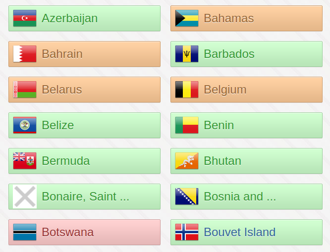

About a week ago, my good friend [@Moof](https://twitter.com/Moof) asked [the question](https://twitter.com/Moof/status/37283994777157633) “Is there a website out there monitoring if countries currently in revolt have full connections to the internet? Is eg Bahrain disconnected?”

I thought this sounded like a challenge too good to pass up, and set about coming up with a way to figure out how we could programattically determine the state of a country’s internet.  

I’ve lately come up against the problem that when faced with a new idea, the hardest problem is getting it created, and working fast enough to ensure that your idea isn’t stolen by another like-minded individual. 

With this in mind, I started work as soon as i’d finished $dayjob at about 5pm on the 14th, and didn’t stop until 3am.  Putting together a week of 5pm - 3am development time, and calling in a favour from a very good designer I know, meant that we were able to launch the site by early friday afternoon.  

isdisconnected.info is a simple at-a-glance view of the world’s internet connection status.  Every country has a button, with their name and flag, which is either Green, Orange or Red, depending on the status of their internet.

Green is a Systems OK, all checks passed state, Orange indicates that some of the country’s server are inaccessible, OR there are no servers registered for that country, and Red indicates that the country is Offline, ie, all servers registered against that country returned a false check status.

The application is written exclusively in Python/Django, and backed onto a PostgreSQL database, with a hint of memcached in there to accelerate the page load-times.  In the hour or two before go-live, I was experimenting with diferent caching settings.

Using no page caching at all, the time to load the index page was about 4s (down to page generation, more than anything), rising to 8-10s whilst handling 20 concurrent connections.  Moof expected a viral response to the site, especially if it ended up on Linklog, or reddit, so fast performance was a high priority. 

Due to the way the pages are generated, some of the data doesn’t lead itself to caching.  Static assets are already served from Nginx, so that’s pretty fast and well behaved.  The individual country pages don’t lend themselves to caching, because some of the data is very changable.  

In spite of that, the service that provides the data for the graph, does heavily cache the stream.  Given that the resolution of the graph is on a scale of hours, the caching time reflects that, so that concurrent hits to a page will get cached graph data.  

We can also anticipate that more hits will occur to a country which is Offline or Unstable, as people will want to find out what’s going on, so having some level of caching on those pages is very important.

I experimented with a site-wide cache of all pages generated, but discovered early on that cache invalidation was a big problem, basically country statuses weren’t updating quickly enough, based on the lifetime of the cache object, so as a trade-off of having more up-to-date information, against not quite caching so much, having a correct view of the global internet won out, naturally.

The index page, now that the list is cached for 10 minutes, loads roughly 1600% faster than before.  There’s two tiers of caching taking place on this page, firstly queries are cached with Memcached (transparently by Django), and sections of the index are template-cached.

I’m very aware that the site is currently prone to false-negatives, that is to say, sometimes countries appear Unstable or Offline when they’re not, but we’ve also seen good reporting of positives, such as Saturday morning when Libya was disconnected.  

This is a beta service, at best, still under active development, and still very much reliant on the power of crowd-sourcing to visit out website, get the word out about the application and the project, and ideally submit IP addresses for us to check.
The more IP addresses we’ve got, the more accurate the check data will be, and then the more accurate the site will be.

It’s very difficult to perform accurate statistical functions on a very small dataset, and when you do, the margin for error is vast.

We’re actively improving the site to make it more feature rich, as well as more accurate by determining servers to register against countries more intelligently.

We’ve got a reasonably good idea of what’s required to make the data even more accurate, and we’re working on that at the moment.  

Update:
-------

Isdisconnected.info was removed from active service around 2015 when the dataset aged beyond accuracy.

[A snapshot was taken by the Wayback Machine however.](https://web.archive.org/web/20110222144110/http://isdisconnected.info/)