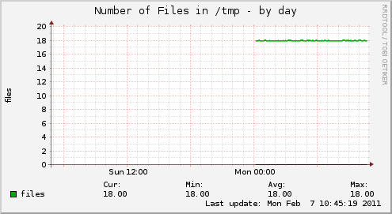

One of the things I’m massively fond of when it comes to systems administration, is logging and monitoring.  I love [munin](https://munin-monitoring.org/), and still prefer it over Cacti and Zabbix.  I think the main reason is that it allows plugins to be configured with absolutely no browser interaction.  
Creating a new graph on cacti and zabbix both require a considerable number of clicks.  It’s easy to install new munin plugins with things like Puppet.  

So.. Munin.  Let’s take a bit of a closer look.

There’s two parts to a munin installation.  Munin server, and munin-node.  

Munin server doesn’t really do the cool stuff, just data aggregation and graph creation.  

I’ve included an example munin.conf [here](https://gist.github.com/tomoconnor/813786).

There’s only a couple of quirks here.  

I’ve found for the majority of installations, that you can leave the vast majority of settings in-place as they are from the version installed by apt / yum / $package_manager_of_your_choice.

So, the actual munin documentation suggests that use_node_name is a dodgy thing to do, but it’s actually pretty useful, especially when you’re defining SNMP hosts.

`use_node_name` tells the not to grapher to use the hostname that’s in `[brackets]`, but instead to use the name in the connection banner (you can see this yourself, once munin is running, to telnet (or nc) to `localhost:4949`, and the line `#munin node at <your host>`)

SNMP hosts.. are without doubt the coolest thing that Munin can do.  by default, the auto-configuration of SNMP hosts will allow you to monitor some interesting things about routers, switches and windows hosts.   So.. the only major quirk about this, is that because the snmp plugins run on one of your munin-node instances, so you have to set that as the address in the host definition.  In the example, I’ve done this on the munin server.  

**Munin-node.**  Very extensible, but as far as config goes, the default configuration that comes in the installation is more than capable. 

[Here’s mine.](https://gist.github.com/tomoconnor/813792)

If you have multiple munin-servers, or want to retrieve munin-plugin data from Nagios servers, then you can add multiple “allow” regex lines.  

 

So.. **Munin plugins.**  This is the Really Cool Stuff.

You can write munin plugins in any language you like.  The vast majority on Munin Exchange  are written in Perl or Bash.  I prefer writing in Python, and the `munin-python` module is gorgeous.  

Basically, you need to handle two things, `config` and `run` modes.  

Munin-run is the thing that handles the plugin, and runs “your-plugin config”.  This is what defines the format of the RRD files that munin uses to generate graphs.  OK, so let’s look at a simple munin plugin.  I think we’ll monitor... the number of files in /tmp (well, why not?)

[Link to code](https://gist.github.com/tomoconnor/813813)

If we run that with `python tmp_files config`, then we get:

```
graph_title Number of Files in /tmp
graph_category system
graph_args --base 1000 -l 0
graph_vlabel files
files.info The number of files in /tmp
files.warning 10
files.critical 120
files.min 0
files.type GAUGE
files.label files
```

and if we run it without “config”, we get: 

`files.value 18`
So, that works.  :)

 

Now if we copy that into `/usr/share/munin/plugins`, and `chmod +x`, and symlink it into `/etc/munin/plugins`.. and restart munin-node.. 

```
$ sudo mv tmp_number.py /usr/share/munin/plugins/tmp_number
$ sudo ln -s /usr/share/munin/plugins/tmp_number /etc/munin/plugins/tmp_number
$ sudo chmod a+x /usr/share/munin/plugins/tmp_number
$ sudo /etc/init.d/munin-node restart
 * Stopping Munin-Node                                                   [ OK ]
 * Starting Munin-Node                                                   [ OK ]
$ munin-run tmp_number
files.value 18
```
 

Cool.  Right.. now that’s done, and munin-node’s been restarted, all we have to do is wait a while, and the new graph will get created.  This can take a while, 5-10 minutes is a good guesstimate, but it can be longer.

This is the graph produced by the plugin:



Clever, eh?

If you find that you’ve waited ages, and still have no graphs, take a look at `/var/log/munin` on the munin-server and munin-node.  There’s plenty of non-cryptic logging there, and it’s all pretty self explanatory.

